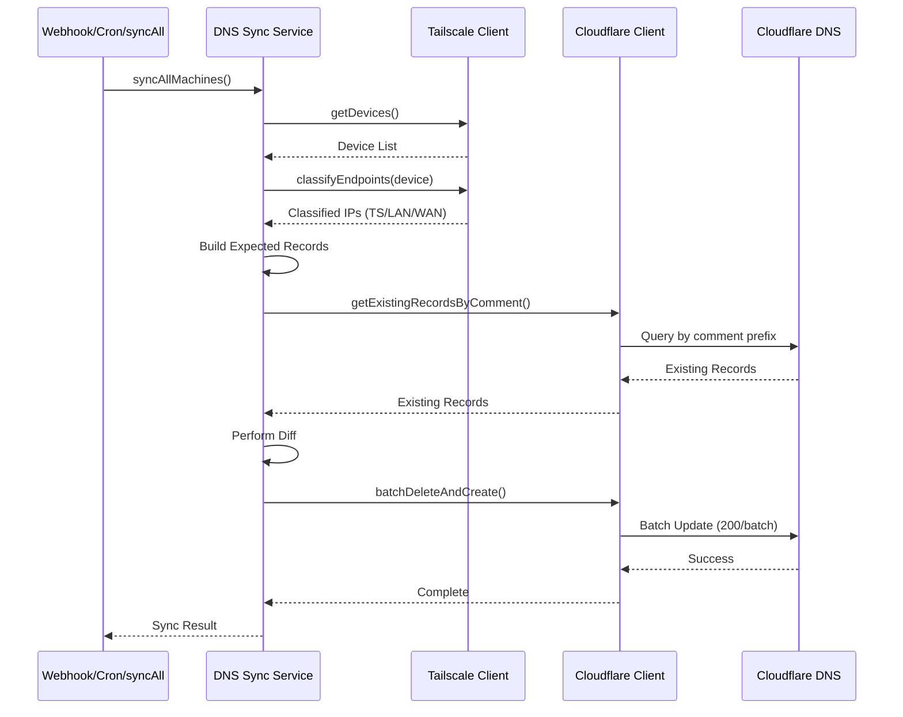

# tailscale-cloudflare

A Cloudflare Worker that automatically syncs DNS records from Tailscale machines to Cloudflare DNS. Each machine creates A records across three configurable domains (Tailscale, WAN, and LAN) with ownership validation using DNS record comments.

## Features

| Feature | Description |
|---------|-------------|
| **Webhook Integration** | Real-time DNS updates when machines are added, updated, or deleted in Tailscale |
| **Cron Sync** | Hourly full synchronization to ensure perfect sync |
| **IP Classification** | Automatically classifies IPs as LAN (private) or WAN (public) based on CIDR ranges |
| **Tag Filtering** | Filter devices by Tailscale tags using regex patterns (optional) |
| **Cloudflare Proxy** | Enable Cloudflare proxy (orange cloud) for devices based on tag regex patterns (optional) |
| **Ownership Validation** | Uses DNS record comments to track ownership and prevent conflicts |
| **Batch Operations** | Efficient batch API usage for Cloudflare free plan (200 records per batch) |

## How It Works



### Component Details

| Component | Description |
|-----------|-------------|
| **Webhook Handler** (`POST /webhook`) | Receives Tailscale webhook events, validates signatures, and triggers full sync of all machines |
| **Cron Handler** (hourly) | Scheduled job that performs full synchronization of all devices from Tailscale to Cloudflare DNS |
| **Manual Sync** (`GET /syncAll`) | Manual endpoint to trigger full synchronization on demand. Useful for testing or immediate sync without waiting for webhook or cron |
| **Configuration API** (`GET /api/config`) | Server-Sent Events (SSE) endpoint that streams real-time configuration snapshots containing Tailscale devices and ACL configuration. Used by first-party extensions/plugins (e.g., [cloudflare-tailscale-traefik](https://github.com/cloudflare-tailscale/cloudflare-tailscale-traefik)) to generate dynamic routing configurations |
| **DNS Sync Service** | Orchestrates the sync process: fetches devices, classifies IPs, builds expected records, fetches existing records, performs diff, and executes batch operations |
| **Tailscale Client** | Handles Tailscale API interactions and IP classification (LAN/WAN/TS) based on configured CIDR ranges |
| **Cloudflare Client** | Manages Cloudflare DNS API operations including fetching records by comment prefix and batch create/delete operations |

### DNS Record Structure

For each machine `<machine-name>`, the following DNS records are created:

| Record Type | Domain Pattern | IP Type | Description |
|-------------|----------------|---------|-------------|
| A | `<machine-name>.<ts-domain>` | Tailscale IP | Tailscale-assigned IP address (typically 100.x.y.z) |
| A | `<machine-name>.<wan-domain>` | WAN IP | Public IP address (before router NAT). Used for dyndns-style CNAME records. Typically points to reverse proxy (e.g., Traefik) which routes to backend services |
| A | `<machine-name>.<lan-domain>` | LAN IP | Private IP address (private IP ranges, matches LAN_CIDR_RANGES) |

Each A record includes an ownership comment for tracking and validation.

### Ownership Comment Format

DNS records use Cloudflare's comment field for ownership tracking:

| Property | Value |
|----------|-------|
| **Format** | `cf-ts-dns:<owner-id>:<machine-name>` |
| **Example** | `cf-ts-dns:cloudflare-tailscale-dns:my-machine` |
| **Purpose** | Identifies which records are managed by this service and prevents conflicts |
| **Limitation** | Comments are truncated to 100 characters to comply with Cloudflare's API limits |

### IP Classification

The worker extracts IP addresses from Tailscale device endpoints. Only **LAN IPs** are classified based on CIDR ranges configured via the `LAN_CIDR_RANGES` environment variable (required, no defaults).

**Note**: 
- **WAN IPs** are any IPs that are not classified as LAN (no explicit classification needed). These are public IP addresses (before router NAT) and are typically used for dyndns-style CNAME records pointing to reverse proxies (e.g., Traefik) rather than direct service connections
- **Tailscale IPs** are returned directly from the Tailscale API and do not require classification

### WAN IP Explanation

**WAN IP** stands for "Wide Area Network IP" and refers to the public IP address assigned to your network by your ISP, before router NAT (Network Address Translation). 

**Key characteristics:**
- **Public IP**: Reachable from the internet
- **Before NAT**: The IP your router receives from your ISP, not the private IP behind NAT
- **Dynamic**: May change if your ISP uses dynamic IP assignment
- **Use case**: Ideal for dyndns-style CNAME records that automatically update when your public IP changes

**Typical usage pattern:**
1. WAN domain records (e.g., `server1.wan.example.com`) point to the public IP
2. Custom domains create CNAME records pointing to WAN domain records
3. Traffic flows: Client → Custom Domain (CNAME) → WAN Domain (A Record) → Public IP → Reverse Proxy (e.g., Traefik) → Backend Services via Tailscale

This eliminates the need for separate dynamic DNS software, as the cloudflare-tailscale-dns service automatically updates WAN domain records when Tailscale detects IP changes.

**Important**: The `LAN_CIDR_RANGES` configuration is ordered. When a device has multiple endpoints that match different CIDR ranges, the endpoint matching the **first range** in the ordered list is chosen as the LAN IP. This allows you to prioritize specific ranges by placing them earlier in the comma-separated list.


## Prerequisites

| Requirement | Description |
|-------------|-------------|
| **Tailscale Account** | Account with API access enabled |
| **Cloudflare Account** | Account with DNS zone configured |
| **Cloudflare API Token** | API token with DNS edit permissions |

## Setup Instructions

### 1. Development Container Setup

This project includes a devcontainer configuration for a consistent development environment.

**Using VS Code:**
1. Open the project in VS Code
2. When prompted, click "Reopen in Container" or use Command Palette: `Dev Containers: Reopen in Container`
3. Dependencies will be automatically installed via the `postStartCommand`

**Using Docker directly:**
```bash
# Build the devcontainer
docker build -f .devcontainer/Dockerfile -t cloudflare-worker-dns .

# Run the container
docker run -it --rm -v $(pwd):/workspace cloudflare-worker-dns
```

The devcontainer automatically runs `npm install && npm run cf-typegen` on startup.

### 2. Configure Environment Variables

**Configure environment variables via Cloudflare Dashboard:**

1. Go to [Cloudflare Dashboard](https://dash.cloudflare.com)
2. Navigate to **Workers & Pages** → Your Worker → **Settings** → **Variables**
3. Configure the following:

**Environment Variables and Secrets:**

| Name | Type | Required | Description | Example/Format/Default |
|------|------|----------|-------------|------------------------|
| `TAILSCALE_TAILNET` | Variable | Yes | Your Tailscale tailnet identifier (e.g., "example.tailscale.com" or just "example") | `example.tailscale.com` |
| `CLOUDFLARE_ZONE_ID` | Variable | Yes | Get from: Cloudflare Dashboard → Your Zone → Overview → Zone ID | `abc123def456` |
| `DOMAIN_FOR_TAILSCALE_ENDPOINT` | Variable | Yes | Domain/subdomain where Tailscale IP records will be created (e.g., "ts.example.com" or "ts" if using root domain) | `ts.example.com` |
| `DOMAIN_FOR_WAN_ENDPOINT` | Variable | Yes | Domain/subdomain where WAN (public IP) records will be created (e.g., "wan.example.com" or "wan" if using root domain) | `wan.example.com` |
| `DOMAIN_FOR_LAN_ENDPOINT` | Variable | Yes | Domain/subdomain where LAN (private IP) records will be created (e.g., "lan.example.com" or "lan" if using root domain) | `lan.example.com` |
| `LAN_CIDR_RANGES` | Variable | Yes | Comma-separated list of CIDR ranges for Private-Use Networks [RFC1918] to classify as LAN (private) IPs. Used to identify private IP addresses that should not be proxied through Cloudflare. **Order matters**: When a device has multiple endpoints matching different ranges, the endpoint matching the first range in the list is chosen as the LAN IP. Common ranges: 10.0.0.0/8, 172.16.0.0/12, 192.168.0.0/16 | `10.0.0.0/8,172.16.0.0/12,192.168.0.0/16` |
| `TAILSCALE_TAG_FILTER_REGEX` | Variable | Yes | Regular expression pattern to filter Tailscale devices by tags. Only devices with at least one tag matching this regex will be synced to DNS. Examples: "^tag:dns" (matches tags starting with "tag:dns"), "tag:server\|tag:production" (matches either tag), "tag:.*-dns" (matches tags ending in "-dns") | `^tag:dns` |
| `TAILSCALE_TAG_PROXY_REGEX` | Variable | Yes | Regular expression pattern to enable Cloudflare proxy (orange cloud) for WAN domain records. Only WAN domain records (public IPs) can be proxied - TS and LAN domains are always DNS-only. Devices with at least one tag matching this regex will have their WAN DNS records proxied through Cloudflare. Examples: "^tag:proxy" (matches tags starting with "tag:proxy"), "tag:public\|tag:web" (matches either tag) | `^tag:proxy` |
| `TAILSCALE_API_KEY` | Secret | Yes | Get from: https://login.tailscale.com/admin/settings/keys. Generate an API key with device read permissions | Starts with `tskey-api-` |
| `CLOUDFLARE_API_TOKEN` | Secret | Yes | Get from: https://dash.cloudflare.com/profile/api-tokens. Create token with: Zone → DNS → Edit permissions | Minimum 40 characters |
| `DNS_RECORD_OWNER_ID` | Variable | No | Unique identifier for DNS record ownership. Only set if multiple instances manage the same DNS zone | `cloudflare-tailscale-dns` |
| `TAILSCALE_WEBHOOK_SECRET` | Secret | No | Secret for validating webhook signatures. Get from: Tailscale Admin Console → Settings → Webhooks. Only required if you want to validate webhook signatures | - |


### 3. Configure Tailscale Webhook (Optional but Recommended)

| Step | Action | Details |
|------|--------|---------|
| 1 | Navigate to Tailscale Admin Console | Go to [Settings → Webhooks](https://login.tailscale.com/admin/settings/webhooks) |
| 2 | Add Webhook | Click **Add Webhook** |
| 3 | Set Webhook URL | `https://your-worker-name.your-subdomain.workers.dev/webhook` |
| 4 | Select Events | Choose: `nodeAdded`, `nodeDeleted`, `nodeUpdated` |
| 5 | Configure Secret | Copy the webhook secret and set it in Cloudflare Dashboard: **Workers & Pages** → Your Worker → **Settings** → **Variables** → **Secrets** → Add `TAILSCALE_WEBHOOK_SECRET` |

### 4. Deploy Worker

```bash
npm run deploy
```

After deployment, note your worker URL (e.g., `https://cloudflare-tailscale-dns.your-subdomain.workers.dev`)

### 5. Verify Cron Trigger

1. Go to [Cloudflare Dashboard](https://dash.cloudflare.com)
2. Navigate to **Workers & Pages → Your Worker → Triggers**
3. Verify cron schedule is active: `0 * * * *` (every hour)

## Development

### Local Development

```bash
npm run dev
```

### Test Webhook Locally

1. Start dev server: `npm run dev`
2. Use a tool like `ngrok` to expose local server: `ngrok http 8787`
3. Configure Tailscale webhook to point to your ngrok URL
4. Test webhook events

### Test Cron Locally

```bash
wrangler dev --test-scheduled
```

This exposes a `/__scheduled` endpoint. Test with:

```bash
curl "http://localhost:8787/__scheduled?cron=0+*+*+*+*"
```

### Generate Type Definitions

```bash
npm run cf-typegen
```

## License

MIT
