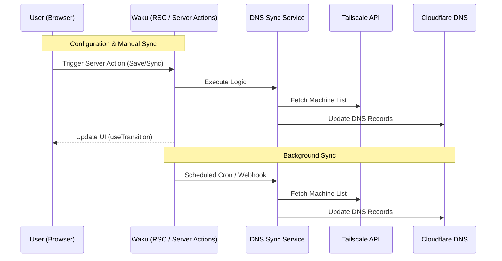

# tailscale-cloudflare

A high-performance Cloudflare Worker built with **Waku** that automatically synchronizes DNS records from Tailscale machines to Cloudflare DNS. 

This project leverages **React Server Components (RSC)** and **Server Actions** to provide a seamless Web UI for configuration and manual synchronization, while maintaining the lightweight footprint of a Cloudflare Worker.

## Tech Stack

| Component | Technology |
|-----------|------------|
| **Framework** | [Waku](https://waku.gg) (React Server Components) |
| **Runtime** | Cloudflare Workers |
| **Storage** | Cloudflare Workers KV |
| **Language** | TypeScript |
| **API** | Hono (Middleware & Webhooks) |
| **Deployment** | Wrangler CLI |

## Features

| Feature | Description |
|---------|-------------|
| **Webhook Integration** | Real-time DNS updates when machines are added, updated, or deleted in Tailscale |
| **Cron Sync** | Hourly full synchronization to ensure perfect sync |
| **IP Classification** | Automatically classifies IPs as LAN (private) or WAN (public) based on CIDR ranges |
| **Tag Filtering** | Filter devices by Tailscale tags using regex patterns (optional) |
| **Cloudflare Proxy** | Enable Cloudflare proxy (orange cloud) for devices based on tag regex patterns (optional) |
| **Ownership Validation** | Uses DNS record comments to track ownership and prevent conflicts |
| **Batch Operations** | Efficient batch API usage for Cloudflare free plan (200 records per batch) |

## How It Works



### Component Details

| Component | Description |
|-----------|-------------|
| **Web UI** (`/`) | Home page with a "Sync Now" button to manually trigger synchronization using React Server Actions |
| **Config UI** (`/config`) | Integrated configuration interface for managing all settings securely using React Server Actions |
| **Webhook Handler** (`POST /webhook`) | Receives Tailscale webhook events, validates signatures, and triggers full sync of all machines |
| **Cron Handler** (hourly) | Scheduled job that performs full synchronization of all devices from Tailscale to Cloudflare DNS |
| **DNS Sync Service** | Orchestrates the sync process: fetches devices, classifies IPs, builds expected records, fetches existing records, performs diff, and executes batch operations |
| **Tailscale Client** | Handles Tailscale API interactions and IP classification (LAN/WAN/TS) based on configured CIDR ranges |
| **Cloudflare Client** | Manages Cloudflare DNS API operations including fetching records by comment prefix and batch create/delete operations |

### DNS Record Structure

For each machine `<machine-name>`, the following DNS records are created:

| Record Type | Domain Pattern | IP Type | Description |
|-------------|----------------|---------|-------------|
| A | `<machine-name>.<ts-domain>` | Tailscale IP | Tailscale-assigned IP address (typically 100.x.y.z) |
| A | `<machine-name>.<wan-domain>` | WAN IP | Public IP address (before router NAT). Used for dyndns-style CNAME records. Typically points to a reverse proxy which routes to backend services |
| A | `<machine-name>.<lan-domain>` | LAN IP | Private IP address (private IP ranges, matches LAN_CIDR_RANGES) |

Each A record includes an ownership comment for tracking and validation.

### Ownership Comment Format

DNS records use Cloudflare's comment field for ownership tracking:

| Property | Value |
|----------|-------|
| **Format** | `cf-ts-dns:<owner-id>:<machine-name>` |
| **Example** | `cf-ts-dns:cloudflare-tailscale-dns:my-machine` |
| **Purpose** | Identifies which records are managed by this service and prevents conflicts |
| **Limitation** | Comments are truncated to 100 characters to comply with Cloudflare's API limits |

### IP Classification

The worker extracts IP addresses from Tailscale device endpoints. Only **LAN IPs** are classified based on CIDR ranges configured via the `LAN_CIDR_RANGES` environment variable (required, no defaults).

**Note**: 
- **WAN IPs** are any IPs that are not classified as LAN (no explicit classification needed). These are public IP addresses (before router NAT) and are typically used for dyndns-style CNAME records pointing to reverse proxies rather than direct service connections
- **Tailscale IPs** are returned directly from the Tailscale API and do not require classification

### WAN IP Explanation

**WAN IP** stands for "Wide Area Network IP" and refers to the public IP address assigned to your network by your ISP, before router NAT (Network Address Translation). 

**Key characteristics:**
- **Public IP**: Reachable from the internet
- **Before NAT**: The IP your router receives from your ISP, not the private IP behind NAT
- **Dynamic**: May change if your ISP uses dynamic IP assignment
- **Use case**: Ideal for dyndns-style CNAME records that automatically update when your public IP changes

**Typical usage pattern:**
1. WAN domain records (e.g., `server1.wan.example.com`) point to the public IP
2. Custom domains create CNAME records pointing to WAN domain records
3. Traffic flows: Client → Custom Domain (CNAME) → WAN Domain (A Record) → Public IP → Reverse Proxy → Backend Services via Tailscale

This eliminates the need for separate dynamic DNS software, as the cloudflare-tailscale-dns service automatically updates WAN domain records when Tailscale detects IP changes.

**Important**: The `LAN_CIDR_RANGES` configuration is ordered. When a device has multiple endpoints that match different CIDR ranges, the endpoint matching the **first range** in the ordered list is chosen as the LAN IP. This allows you to prioritize specific ranges by placing them earlier in the comma-separated list.


## Prerequisites

| Requirement | Description |
|-------------|-------------|
| **Tailscale Account** | Account with API access enabled |
| **Cloudflare Account** | Account with DNS zone configured |
| **Cloudflare API Token** | API token with DNS edit permissions |

## Setup Instructions

### 1. Development Container Setup

This project includes a devcontainer configuration for a consistent development environment.

**Using VS Code:**
1. Open the project in VS Code
2. When prompted, click "Reopen in Container" or use Command Palette: `Dev Containers: Reopen in Container`
3. Dependencies will be automatically installed via the `postStartCommand`

**Using Docker directly:**
```bash
# Build the devcontainer
docker build -f .devcontainer/Dockerfile -t cloudflare-worker-dns .

# Run the container
docker run -it --rm -v $(pwd):/workspace cloudflare-worker-dns
```

The devcontainer automatically runs `npm install && npm run cf-typegen` on startup.

### 2. Configure Cloudflare KV Namespace

The worker uses Cloudflare KV to store all configuration settings. You need to create a KV namespace and bind it to your worker.

**Option 1: Using Wrangler CLI (Recommended for Development)**

1. Create a KV namespace:
   ```bash
   wrangler kv:namespace create "CONFIG_KV"
   ```

2. Copy the namespace ID from the output and add it to `wrangler.jsonc`:
   ```jsonc
   "kv_namespaces": [
     {
       "binding": "CONFIG_KV",
       "id": "your-namespace-id-here"
     }
   ]
   ```

**Option 2: Using Cloudflare Dashboard**

1. Go to [Cloudflare Dashboard](https://dash.cloudflare.com)
2. Navigate to **Workers & Pages** → **KV**
3. Click **Create a namespace**
4. Name it (e.g., `tailscale-config-kv`) and create it
5. Go to **Workers & Pages** → Your Worker → **Settings** → **Variables**
6. Scroll to **KV Namespace Bindings** and click **Add binding**
7. Set **Variable name** to `CONFIG_KV` and select your namespace

### 3. Deploy Worker

```bash
npm run deploy
```

After deployment, note your worker URL (e.g., `https://cloudflare-tailscale-dns.your-subdomain.workers.dev`)

### 4. Configure Settings via Web UI

After deployment, navigate to `https://your-worker-name.your-subdomain.workers.dev/config` to configure all settings through the web interface. The configuration page includes detailed instructions and validation for each setting.

**Optional Environment Variable:**

You can optionally set `DNS_RECORD_OWNER_ID` as an environment variable in the Cloudflare Dashboard if you need multiple instances managing the same DNS zone:

1. Go to **Workers & Pages** → Your Worker → **Settings** → **Variables**
2. Add `DNS_RECORD_OWNER_ID` with a unique identifier (default: `cloudflare-tailscale-dns`)


### 5. Configure Tailscale Webhook (Optional but Recommended)

The worker can receive Tailscale webhooks for real-time updates.

1. **Deploy Worker**: Deploy your worker first (see step 3 above)

2. **Configure Settings**: Configure your settings via the `/config` UI (see step 4 above)

3. **Provide Webhook Secret**: If you have a Tailscale webhook, you can manually set its secret in the `/config` UI or via KV.

4. **Trigger Sync**: You can trigger a manual sync anytime using the **"Sync Now"** button on the Home page.

### 6. Verify Deployment

After deployment, navigate to your worker URL and verify you can access the Home and Config pages. Use the "Sync Now" button to perform your first synchronization.

### 7. Verify Cron Trigger

1. Go to [Cloudflare Dashboard](https://dash.cloudflare.com)
2. Navigate to **Workers & Pages → Your Worker → Triggers**
3. Verify cron schedule is active: `0 * * * *` (every hour)

## Development

### Project Structure

| Directory/File | Description |
|----------------|-------------|
| `src/pages/` | Waku file-based routing (e.g., `index.tsx`, `config.tsx`) |
| `src/actions.ts` | **Server Actions** for form handling and manual sync |
| `src/components/` | React components (both Server and Client components) |
| `src/services/` | Core business logic (Tailscale/Cloudflare integration) |
| `src/middleware/` | Hono middleware for environment and settings validation |
| `src/handlers/` | Background job handlers (Cron, Webhooks) |
| `wrangler.jsonc` | Cloudflare Worker and Assets configuration |

### Local Development

```bash
npm run dev
```
By default, the dev server runs at `http://localhost:3000`.

### Test Webhook Locally

1. Start dev server: `npm run dev`
2. Use a tool like `cloudflared` or `ngrok` to expose local server: `cloudflared tunnel --url http://localhost:3000`
3. Configure Tailscale webhook to point to your tunnel URL
4. Test webhook events

### Test Cron Locally

```bash
npx wrangler dev --test-scheduled
```

This exposes a `/__scheduled` endpoint. Test with:

```bash
curl "http://localhost:3000/__scheduled?cron=0+*+*+*+*"
```

### Generate Type Definitions

```bash
npm run cf-typegen
```

## License

MIT
