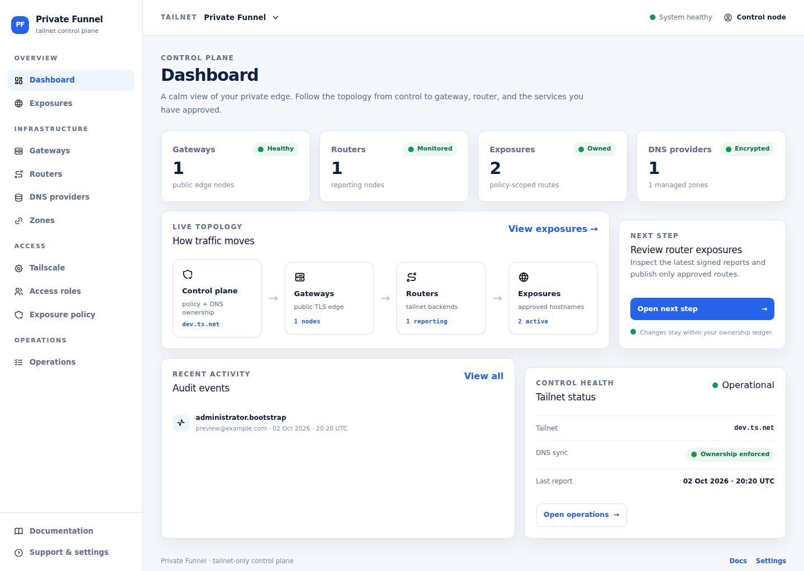

# tailscale-private-funnel

One Go executable provides the private control plane, public gateway, and Docker
router. Modes are top-level CLI namespaces:

```sh
tailscale-private-funnel control join
tailscale-private-funnel control serve
tailscale-private-funnel gateway serve
tailscale-private-funnel router serve
```

Only `control join` opens the Bubble Tea bootstrap UI. The control web UI
generates non-interactive gateway and router commands after issuing their
Tailscale auth keys.

## Control dashboard

The control UI keeps the most important decision in view: how the control
plane, gateways, routers, and policy-approved exposures relate to each other.
The next-step panel points an operator to the first missing configuration while
the ownership ledger and health state remain visible beside recent audit events.



This screenshot uses synthetic identities and the `example.com` development
zone. Credentials and live DNS data are never rendered into release assets.

## Build and test

```sh
go test ./...
go test -tags caddy ./...
go vet ./...
go build -tags caddy ./cmd/tailscale-private-funnel
```

The container build is defined in `Dockerfile.private-funnel`. The executable
stores its SQLite database, encrypted settings, and Tailscale state under the
configured data and state directories.

## Control bootstrap

Run the control join command on the control host. Optional values default to the
machine hostname, platform config directory, and the official Tailscale control
server. For automation, provide an auth key file and `--non-interactive`.

```sh
tailscale-private-funnel control join --auth-key-file ./control.key
tailscale-private-funnel control serve
```

After joining, open the printed tailnet URL. Configure Tailscale OAuth, tags,
administrators, DNS providers, zones, gateways, and routers in the web UI.

For generated gateway/router enrollment, set an enrollment bootstrap listener on
the control service (this listener exposes only the code-protected auth-key
exchange, while the management UI remains tailnet-only), for example:

```sh
tailscale-private-funnel control serve --bootstrap-listen 0.0.0.0:8081
```

Save that URL as **Enrollment bootstrap URL** in Tailscale settings. Enrollment
codes are reusable until revoked; each redemption mints a fresh short-lived
Tailscale auth key and binds the node's report signing key after it joins.

The UI uses Tailscale WhoIs for authorization. Configure `admin`, `operator`,
and `viewer` selectors in **Tailscale and control roles**. Selectors can be
users, `group:...`, `tag:...`, `user:...`, or `node:...`; viewers can read,
operators can preview and sync, and admins can change configuration.
Tailscale Owner/Admin account roles are managed in the Tailscale admin console
and are not a stable application claim in WhoIs, so map them to this app with
groups, tags, node selectors, or an application capability.
Tagged service nodes do not inherit the creator's user role. Use their tag or
node selector, or configure a custom Tailscale app capability such as
`example.com/cap/private-funnel` with a payload like `{"roles":["operator"]}`.
The capability is read from WhoIs, not from request headers.

Before a router can auto-provision DNS, create an enabled rule in **Router
exposure policy**. Rules match the complete public hostname and require a
router role or node selector. An empty policy is default-deny, so a newly
enrolled router cannot publish arbitrary domains. The policy also gates manual
router exposure requests; operator access cannot bypass it.

## Gateway and router containers

The UI returns separate `join` and `serve` commands. Run the join command once,
then run the generated server command. Persist the state and data directories
so a replacement keeps its Tailscale identity and Caddy certificates. A
gateway publishes the public ports; only a router mounts the Docker socket:

```sh
docker run -d --name private-funnel-gateway \
  --user "$(id -u):$(id -g)" \
  -p 80:80 -p 443:443 \
  -v "$PWD/gateway-state:/state" -v "$PWD/gateway-data:/data" \
  ghcr.io/tailscale-x/tailscale-private-funnel:v0.1.0 gateway serve \
  --hostname public-gateway --state-dir /state --data-dir /data

docker run -d --name private-funnel-router \
  --user "$(id -u):$(id -g)" \
  -v /var/run/docker.sock:/var/run/docker.sock \
  -v "$PWD/router-state:/state" -v "$PWD/router-data:/data" \
  --group-add "$(stat -c '%g' /var/run/docker.sock)" \
  -e FUNNEL_INGRESS_NETWORK=private-funnel-ingress \
  ghcr.io/tailscale-x/tailscale-private-funnel:v0.1.0 router serve \
  --hostname docker-router --state-dir /state --data-dir /data
```

Attach HTTP services and the router to the same ingress network, and use the
`caddy` labels supported by caddy-docker-proxy, including
`caddy.reverse_proxy={{upstreams PORT}}`. Update with `docker pull` and a new
container; roll back by starting the previous image tag with the same mounts.
The router report agent requires that dedicated ingress network and publishes
only labeled HTTP services. Missing ingress reachability is reported and does
not create DNS records.

## Provider catalog

The DNS layer uses libdns interfaces. Cloudflare, GoDaddy, and Amazon Route 53
have concrete adapters in this build; the remaining catalog entries are
metadata until their provider modules are intentionally linked. Credentials are
encrypted with a local master key and are never placed in environment
variables.

## Release

Pull requests run Go tests, vet, and the build. Version tags publish
`ghcr.io/tailscale-x/tailscale-private-funnel:<tag>` after those checks pass.
The first stable tag is `v1.0.0`; its release includes native binaries,
multi-architecture images, checksums, release metadata, and the dashboard
screenshot above.
